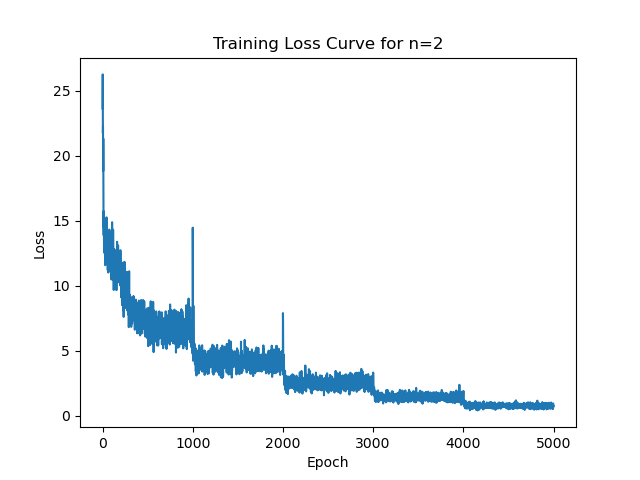
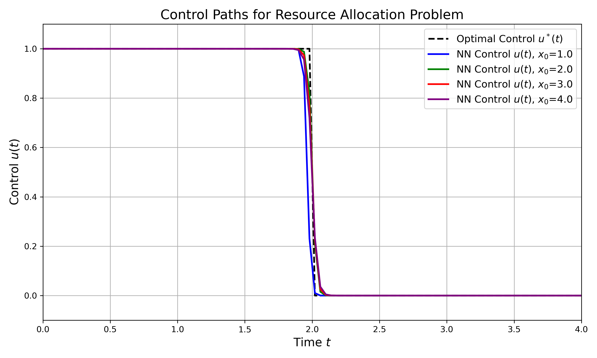

# Neural HJB: Neural Network Solutions for Hamilton-Jacobi-Bellman Equations


**Neural HJB** is a comprehensive repository designed to leverage neural networks for solving Hamilton-Jacobi-Bellman (HJB) equations in optimal control problems. This project encompasses two primary applications:

1. **2D Motion Control**
2. **Resource Allocation**

Each application includes model training, evaluation, and visualization scripts to demonstrate the effectiveness of neural network-based approaches in approximating optimal control strategies.

---

## Table of Contents

- [Features](#features)
- [Repository Structure](#repository-structure)
- [Installation](#installation)
- [Usage](#usage)
  - [2D Motion Control](#2d-motion-control)
  - [Resource Allocation](#resource-allocation)
- [Results](#results)
  - [2D Motion Control](#2d-motion-control-results)
  - [Resource Allocation](#resource-allocation-results)
- [Figures](#figures)
- [Contributing](#contributing)
- [License](#license)
- [Contact](#contact)

---

## Features

- **Neural Network Architectures**: Implementation of `UNet` and `JNet` models tailored for solving HJB equations.
- **Automatic Differentiation**: Utilization of PyTorch's automatic differentiation for gradient computations essential in HJB residual calculations.
- **ODE Integration**: Integration of system dynamics using `torchdiffeq`'s `odeint` for simulating state and cost trajectories.
- **Evaluation Metrics**: Calculation of Mean Squared Error (MSE) to quantify the accuracy of neural network predictions against analytical solutions.
- **Visualization Tools**: Scripts for generating insightful plots, including control paths, error distributions, and training loss curves, suitable for academic publications.

---

## Repository Structure

```
neural_hjb/
├── README.md
├── motion_control
│   ├── models
│   ├── results
│   │   ├── data
│   │   │   ├── n2_training_losses.pt
│   │   │   ├── n4_training_losses.pt
│   │   │   ├── n6_training_losses.pt
│   │   │   └── n8_training_losses.pt
│   │   ├── mse_tables
│   │   │   └── mse_results.csv
│   │   └── plots
│   │       ├── heatmaps
│   │       │   └── heatmaps_n2.png
│   │       ├── mse_vs_dimension.png
│   │       ├── n2
│   │       │   ├── j_net_error_distribution.png
│   │       │   └── u_net_error_distribution.png
│   │       ├── n4
│   │       │   ├── j_net_error_distribution.png
│   │       │   └── u_net_error_distribution.png
│   │       ├── n6
│   │       │   ├── j_net_error_distribution.png
│   │       │   └── u_net_error_distribution.png
│   │       ├── n8
│   │       │   ├── j_net_error_distribution.png
│   │       │   └── u_net_error_distribution.png
│   │       └── training_curves
│   │           ├── n2_training_loss.png
│   │           ├── n4_training_loss.png
│   │           ├── n6_training_loss.png
│   │           └── n8_training_loss.png
│   └── scripts
│       ├── __pycache__
│       │   └── utils.cpython-312.pyc
│       ├── evaluate.py
│       ├── heatmaps.py
│       ├── train.py
│       └── utils.py
├── requirements.txt
└── resource_allocation
    ├── models
    │   └── resource_allocation
    │       ├── j_net_stage_0.pth
    │       ├── j_net_stage_1.pth
    │       ├── j_net_stage_2.pth
    │       ├── j_net_stage_3.pth
    │       ├── j_net_stage_4.pth
    │       ├── u_net_stage_0.pth
    │       ├── u_net_stage_1.pth
    │       ├── u_net_stage_2.pth
    │       ├── u_net_stage_3.pth
    │       └── u_net_stage_4.pth
    ├── results
    │   └── resource_allocation
    │       ├── data
    │       │   └── training_losses.pt
    │       ├── mse_tables
    │       │   └── mse_results.csv
    │       └── plots
    │           ├── control_paths_resource_allocation.png
    │           └── u_net_error_distribution.png
    └── scripts
        ├── __pycache__
        │   └── utils.cpython-312.pyc
        ├── evaluate.py
        ├── show_various_paths.py
        ├── train.py
        └── utils.py
```

---

## Installation

### Prerequisites

- Python 3.12
- pip

### Clone the Repository

```bash
git clone https://github.com/rfarell/neural_hjb.git
cd neural_hjb
```

### Install Dependencies

It is recommended to use a virtual environment:

```bash
python3.12 -m venv venv
source venv/bin/activate  # On Windows: venv\Scripts\activate
pip install --upgrade pip
pip install -r requirements.txt
```

---

## Usage

The repository is organized into two main directories, each corresponding to a specific optimal control problem:

1. **Motion Control**
2. **Resource Allocation**

Each directory contains scripts for training models, evaluating performance, and visualizing results.

### 2D Motion Control

#### Training Models

Navigate to the `motion_control/scripts` directory and run the training script:

```bash
cd motion_control/scripts
python train.py --num_epochs 1000
```

**Parameters:**

- `--num_epochs`: Number of training epochs (default: 1000).

#### Evaluating Models

After training, evaluate the model's performance:

```bash
python evaluate.py
```

#### Visualizing Results

Generate heatmaps and other plots:

```bash
python heatmaps.py
```

### Resource Allocation

#### Training Models

Navigate to the `resource_allocation/scripts` directory and run the training script:

```bash
cd ../resource_allocation/scripts
python train.py --num_epochs 1000
```

**Parameters:**

- `--num_epochs`: Number of training epochs (default: 1000).

#### Evaluating Models

After training, evaluate the model's performance:

```bash
python evaluate.py
```

#### Visualizing Control Paths

To visualize the control paths for different initial conditions:

```bash
python show_various_paths.py
```

---

## Results

### 2D Motion Control Results



*Figure 1: Training loss curves for different network stages in the 2D Motion Control problem.*

**Description:**

The training loss curves demonstrate the convergence of the neural networks over epochs. Lower loss values indicate better approximation of the optimal control and cost-to-go functions.

### Resource Allocation Results



*Figure 2: Comparison of neural network-predicted control $u(t)$ for different initial production rates $x_0$ against the analytical optimal control $u^*(t)$. The neural network accurately captures the switching behavior at $t = 2$, aligning closely with the theoretical solution.*

**Description:**

The plot showcases the control trajectories $u(t)$ predicted by the neural network for various initial conditions $x_0$, alongside the analytical optimal control $u^*(t)$. The low Mean Squared Error (MSE) of $\text{MSE}_{u} = 0.00487$ indicates high accuracy in the neural network's predictions.

---

## Figures

### 1. Training Loss Curves for 2D Motion Control


*Figure 1: Training loss curves for different network stages in the 2D Motion Control problem.*

### 2. Control Paths for Resource Allocation


*Figure 2: Comparison of neural network-predicted control $u(t)$ for different initial production rates $x_0$ against the analytical optimal control $u^*(t)$. The neural network accurately captures the switching behavior at $t = 2$, aligning closely with the theoretical solution.*

---

